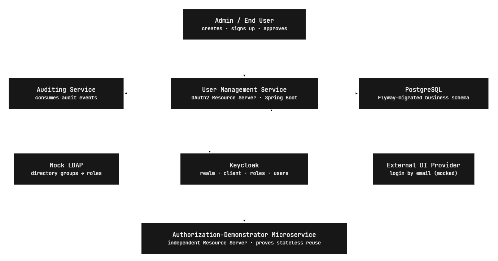
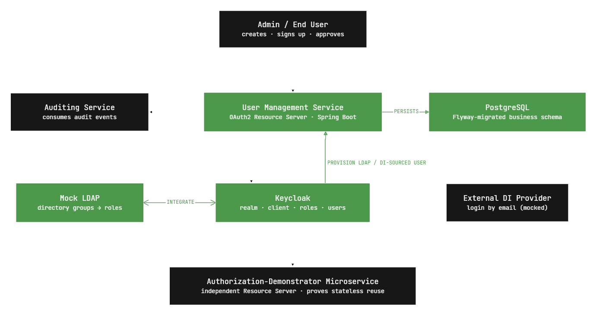
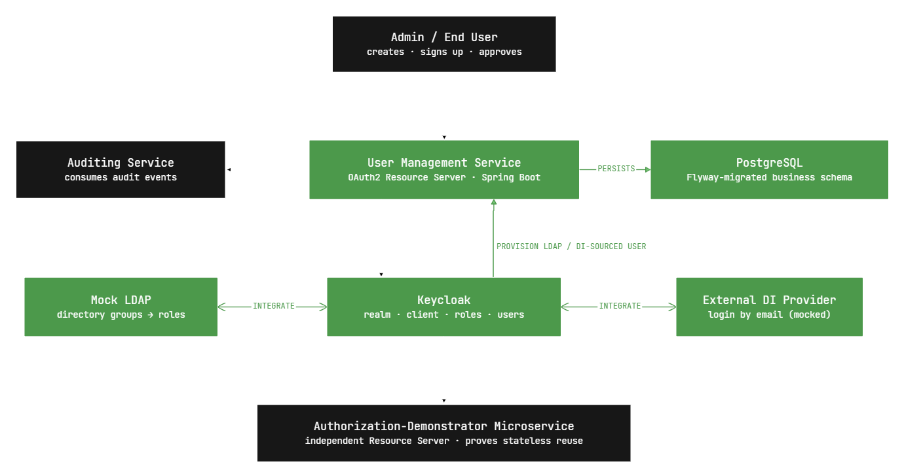
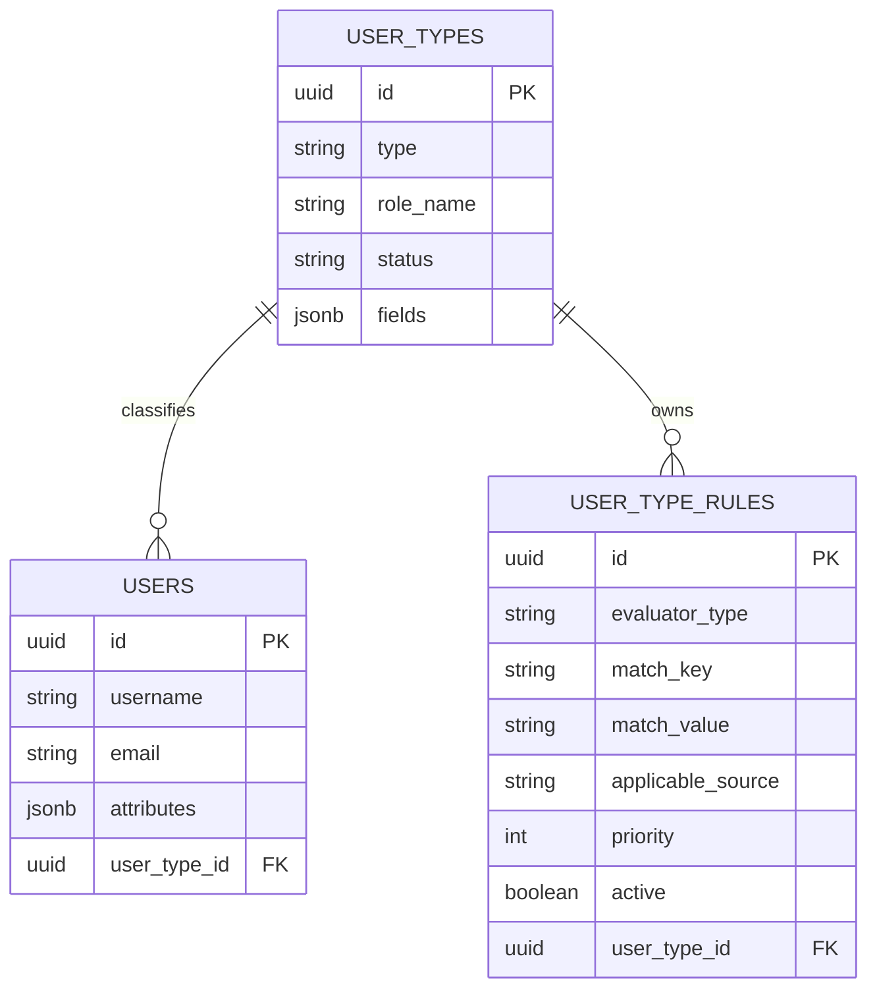
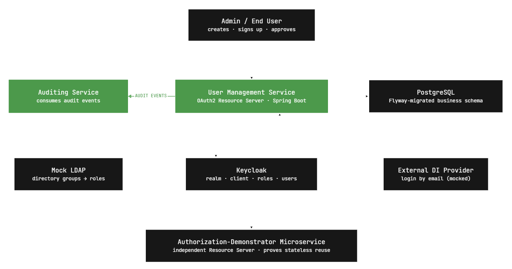

# User Management Contributions

## 1. Purpose and Context

`user-management-service` is the application-facing source of managed-user data. It stores users and user types in PostgreSQL, accepts user-management API requests, consumes provisioning events from Kafka, and publishes audit events.

Keycloak is the identity and access-management layer. It authenticates users from four different sources admin creation, LDAP, external identity provider, or self-signup. It issues JWTs, and is kept aligned with the service where required. Kafka carries provisioning and audit events; the auditing service is an independent consumer of the audit topic.



## 2. Covered Contributions

These are the main contributions by `Momen Abdelkader`.

| Area | Responsibility | Main integration | Sources |
| --- | --- | --- | --- |
| LDAP federation | Authenticate directory users and map their groups to roles | LDAP <-> Keycloak | LDAP |
| User provisioning | Maintain local managed-user records from Keycloak events | Keycloak SPI -> Kafka -> service | LDAP, identity provider, admin |
| User-type resolution | Classify provisioned users and synchronize the resolved type | Service outbox -> Keycloak | LDAP attributes and service rules |
| Audit publishing | Publish auditable operations for external consumption | Service -> Kafka | Service operations |

## 3. LDAP Federation and Authorization

LDAP is the authority for LDAP user data and schema. Keycloak federates LDAP users, imports their group membership, and maps Keycloak groups to realm roles. Realm roles are associated with client roles (permissions) and is emitted in the JWT and used by the service for authorization.


### Required Keycloak Configuration

1. Configure an LDAP user-federation provider and enable user import.
2. Enable periodic full and changed-user synchronization; keep **Sync Registrations** disabled.
3. Add the LDAP group mapper and assign the appropriate realm roles to the resulting Keycloak groups.
4. Add the custom `ldap-provisioning-mapper` so LDAP imports and synchronization also publish provisioning events.

Full configuration is covered in [integrating-keycloak-with-openldap](integrating-keycloak-with-openldap.md) for the provider, sync, group-mapper, and mapper settings.

[openldap-setup](openldap-setup.md) covers how to setup openldap locally and interact with it.



**Notes**

- The LDAP-owning party defines the LDAP schema and must provide the attributes used for user-type rules.
- Keycloak does not write registrations back to LDAP because `Sync Registrations` is disabled.
- LDAP write-back requires a writable LDAP provider and attribute mappers configured for writing; otherwise LDAP attributes remain read-only.

## 4. User Provisioning

Users enter the service from `LDAP`, `IDENTITY_PROVIDER`, or `ADMIN`. The Keycloak provider module contains an `EventListenerProvider` for Keycloak-side events and an `LDAPStorageMapper` for LDAP imports. Both publish `UserProvisioningEvent` messages to Kafka topic `user-events`.


The consumer creates, updates, or deletes the local `users` record. When an LDAP user's resolved type changes, it creates an outbox item; the scheduled outbox processor performs the Keycloak update after the database transaction commits.

### Provisioning Event Contract

```json
{
  "eventType": "USER_CREATED | USER_UPDATED | USER_DELETED | USER_BLOCKED | USER_UNBLOCKED",
  "source": "LDAP | IDENTITY_PROVIDER | ADMIN",
  "keycloakId": "uuid",
  "username": "string",
  "email": "string|null",
  "attributes": { "employeeType": ["Employee"], "dn": ["uid=jdoe,..."] },
  "timestamp": "ISO-8601 instant"
}
```

Delete events require `eventType`, `source`, `keycloakId`, and `timestamp`; other user fields may be absent.

### Deployment and Configuration

- Build and deploy the `keycloak-user-provisioning` JAR to Keycloak's providers directory, then restart Keycloak.
- Enable provider `user-service-provisioning-listener` in the realm's event-listener configuration.
- Add mapper type `ldap-provisioning-mapper` to the LDAP provider.
- Configure both components to use the same Kafka cluster and `user-events` topic. The service binding is `userProvisioningConsumer-in-0` with consumer group `user-management`.




## 5. Dynamic User-Type Resolution

The LDAP-owning party owns the LDAP schema and supplies the attributes used to classify its users. It must also supply the required `user_types` and `user_type_rules` as Flyway SQL migrations. These migrations are applied to the user-management database during deployment; the service does not receive or create them at runtime.

The service evaluates active rules for the event source, including source-agnostic rules, in descending priority order. The first matching rule selects the user type.

Supported evaluator types are:

- `ATTRIBUTE` — matches a value in an event attribute.
- `RDN` — matches a requested RDN attribute in the LDAP distinguished name.
- `FALLBACK` — always matches and should have the lowest priority.

Each LDAP provider must include a `FALLBACK` rule in its Flyway migration and point it to that provider's intended default user type. This makes the normal fallback configurable through rule data. The seeded `Provisioned` type is retained only as a safety guard for missing or invalid rule configuration. The resolved type is stored with the user and is sent to Keycloak as the `user_type` user attribute during synchronization.

### Evaluation and Extensibility

At application startup, Spring discovers all `UserTypeRuleEvaluator` implementations and registers them in `UserTypeRuleEvaluatorRegistry` by evaluator type. For each rule, `UserTypeMappingService` obtains the matching evaluator from the registry and calls `evaluate(rule, event)`.

To add a new rule type, implement `UserTypeRuleEvaluator`, add its type to the `RuleEvaluatorType` enum, and register it as a Spring component. The registry fails fast if two evaluators use the same type.

> **Important**: The LDAP-provider-specific user types and rules are maintained through Flyway migrations; there is no rule CRUD API. `/api/userTypes` remains available for service-managed user-type operations and validates the associated Keycloak role.



## 6. Audit Event Publishing and Consumption

Service methods annotated with `@PublishAuditEvent` produce JSON audit events through Spring Cloud Stream. The destination is Kafka topic `audit-events`.

### Audit Annotations and Resolution

Use `@PublishAuditEvent` on the service method. It defines the action, optional metadata, and optional method-level resource and actor data. Use `@AuditResource` and `@AuditActor` on the service implementation class when those values are shared by its methods.

```java
@AuditActor(id = "provisioning-service")
@AuditResource(type = ResourceType.USER, idSpEL = "#event.keycloakId()")
class UserProvisioningServiceImpl {

    @PublishAuditEvent(
        actionType = ActionType.USER_DELETE,
        metadataSpEL = "{'source': #event.source().name()}"
    )
    public void handleUserDeleted(UserProvisioningEvent event) { ... }
}
```

Resolution order is:

| Field | Resolution order |
| --- | --- |
| Action type | `actionTypeSpEL` on `@PublishAuditEvent`, then `actionType` on the same annotation. |
| Resource | Method-level `resourceType` **and** `resourceIdSpEL`, then class-level `@AuditResource`, then no audit event is published and the error is logged. |
| Actor | Method-level `actorId`/`actorUsername`, then class-level `@AuditActor`, then JWT subject and `preferred_username`, then `SYSTEM` / `system`. |
| Metadata | `metadataSpEL` on `@PublishAuditEvent`; an empty or unresolved expression produces an empty map. |

When overriding resource data at method level, always set **both** `resourceType` and `resourceIdSpEL`. The aspect only uses the method-level resource when both are present; otherwise it falls back to `@AuditResource` on the class.

When overriding actor data at method level, always set **both** `actorId` and `actorUsername`. The implementation selects the method-level actor when `actorId` is present, so omitting `actorUsername` produces an actor with a blank name instead of falling back to `@AuditActor` or the JWT.

```java
@PublishAuditEvent(
    actionType = ActionType.USER_UPDATE,
    resourceType = ResourceType.USER,
    resourceIdSpEL = "#id.toString()",
    actorId = "provisioning-service",
    actorUsername = "Provisioning Service"
)
```

```json
{
  "eventId": "uuid",
  "eventType": "AUDIT",
  "occurredAt": "ISO-8601 instant",
  "sourceService": "user-management-service",
  "data": {
    "actionType": "USER_CREATE",
    "actor": { "id": "string", "name": "string" },
    "resource": { "id": "string", "type": "USER" },
    "outcome": "SUCCESS | FAILURE",
    "reason": null,
    "correlationId": "uuid",
    "metadata": {}
  }
}
```

Minimal Spring Cloud Stream consumer:

```java
@Bean
Consumer<AuditEvent> auditConsumer() {
    return event -> log.info("Audit event: {}", event.getEventId());
}
```

```properties
spring.cloud.function.definition=auditConsumer
spring.cloud.stream.bindings.auditConsumer-in-0.destination=audit-events
spring.cloud.stream.bindings.auditConsumer-in-0.group=<consumer-group>
spring.cloud.stream.bindings.auditConsumer-in-0.content-type=application/json
```

Consumers should be idempotent because Kafka delivery can be at least once. Audit publish failures are logged and do not fail the original business operation.



## 7. Operational Notes and Limitations

- Database changes and Keycloak synchronization are eventually consistent through the outbox pattern.
- Deleting users from the LDAP's side is not provisioned due to the limitations of the interfaces Keycloak SPI provides. This may require more investigation to find an appropriate solutino to sync the deletions coming from LDAP.
- `keycloak-user-provisioning` is a standalone Keycloak provider module, not part of the Spring application context.
- Audit events are created only for annotated methods invoked through Spring's proxy; self-invocation and private methods are not intercepted.
---
